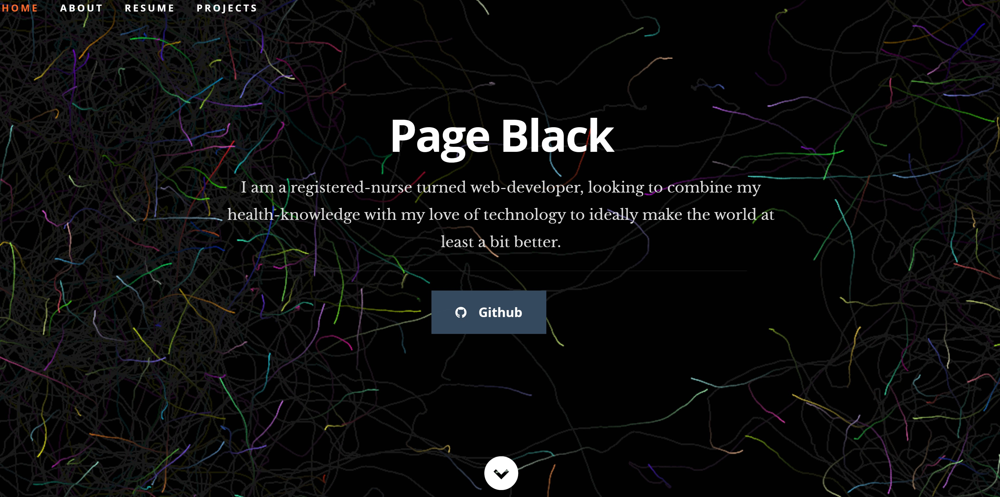

# Portfolio with React

## Description
Using Create React App and a template I've developed a portfolio to showcase some of my unique abilities and projects. The modern design and sleek structure are eye catching while also presenting an opportunity to see how some of the experts use React. Components were changed to add some different styles as well as introduce React-bootstrap components to the project area.

## Screenshot
[Link to Site](https://noheropage.github.io/base-react-portfolio/)

### Special Thanks
To [Nordicgiant2](https://github.com/nordicgiant2/react-nice-resume) for sharing their modern, sleek portfolio template.